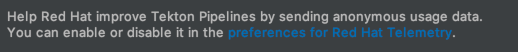

# Red Hat Telemetry
[plugin-repo]: https://plugins.jetbrains.com/plugin/16209-telemetry-by-red-hat
[plugin-version-svg]: https://img.shields.io/jetbrains/plugin/v/16209-telemetry-by-red-hat.svg
[plugin-downloads-svg]: https://img.shields.io/jetbrains/plugin/d/16209-telemetry-by-red-hat.svg

[](https://github.com/redhat-developer/intellij-redhat-telemetry/actions?query=workflow%3A%22Java+CI+with+Gradle%22)
[![JetBrains plugins][plugin-version-svg]][plugin-repo]
[![JetBrains plugins][plugin-downloads-svg]][plugin-repo]

This library provides Telemetry APIs specifically meant to be used by IDEA plugins developped by Red Hat.
## Telemetry reporting
With your approval, plugins published by Red Hat collect anonymous 
[usage data](https://github.com/redhat-developer/intellij-redhat-telemetry/blob/master/USAGE_DATA.md) 
and send it to Red Hat servers to help improve our products and services. Read our 
[privacy statement](https://developers.redhat.com/article/tool-data-collection) to learn more about it.

The first time one of Red Hat plugins is engaging in telemetry collection runs, you will be asked to opt-in Red Hat's 
telemetry collection program:


Whether you accept or deny the request, this pop up will not show again. 
If you choose Later, you'll get asked once you restart your IDE.

You can also opt-in later, by enabling it in the preferences at Tools > Red Hat Telemetry.


This will enable all telemetry events from Red Hat plugins going forward.

## How to disable telemetry reporting?
If you want to stop sending usage data to Red Hat, you can disable it in the preferences at Tools > Red Hat Telemetry.
This will silence all telemetry events from Red Hat plugins going forward.

## How to use from a IDEA plugin extension?

### Dependency
Start by adding `com.redhat.devtools.intellij.telemetry` to the plugins section of your build.gradle, so that the dependency can be automatically downloaded and installed, when installing your extension from the Marketplace.
```groovy
plugins "com.redhat.devtools.intellij.telemetry:0.0.1.9"
```

### [Optional] Add custom segment keys in src/main/resources/segment.properties
By default, extensions will send their data to https://app.segment.com/redhat-devtools/sources/intellij/. 
In development mode, the data is sent to https://app.segment.com/redhat-devtools/sources/intellij_test/.
You can specify custom segment keys to connect and push usage data to https://segment.com/
```properties
"writeKey": "your-segment-key-goes-here",
"debugWriteKey": "your-segment-key-goes-here-for-dev-mode",
```

### Create a Telemetry singleton
You then need to create a singleton that allows you to get hold of the telemetry service.
Lazy initialisation allows late construction when things are needed.

```java
public class TelemetryService {

    private static final TelemetryService INSTANCE = new TelemetryService();

    private final Lazy<TelemetryMessageBuilder> builder = new Lazy<>(() -> new TelemetryMessageBuilder(TelemetryService.class.getClassLoader()));

    public static TelemetryMessageBuilder instance() {
        return INSTANCE.builder.get();
    }
}
```
### Send a message

To report an event you first need to get a hold on telemetry singleton and start by telling it what action you're about to build.
Good practice suggests prefixing your action by a group name that you separate with a "-". 
Colons (":") cannot be used due to limitations in wooopra which won't automatically create a schema for your message in that case. 
```java
ActionMessage telemetry = TelemetryService.instance().action("smurfs-find the magic cauldron");
```
You can then chain properties with their values to the point where you can send the message.
```java
telemetry
    .property("kindness", "smurfette")
    .property("magic", "papa smurf")
    .send();   
```

### Send special properties
The telemetry plugin tracks the startup and shutdown of your plugin automatically.
There's no need for you to send those messages, it's all done for you behind the scene.

Success may be used to indicate particular outcomes.
```java
telemetry.success("found the magic cauldron")
```
Errors are passed along similarly. Error and success are both mutually exclusive.
```java
telemetry.error("Gargamel was there")
```
A duration may be provided to indicate how long an operation took. You start by signaling when the action started. 
```java
telemetry.started()
```
Once the action is finished you provide the end time to the message.
```java
telemetry.finished(LocalDateTime.now())
```
Not providing it won't harm, it'll done automatically for you.

### Retrieve the anonymous User Id
Each message sends an anonymous user id along with the other payloads. 
This type 4 UUID is automatically created and stored in a file at `~/.redhat/anonymousId` 
To retrieve it you can query the class `UserId`.
```java
String userId = UserId.INSTANCE.get()
```

### Add a link to telemetry preferences
Telemetry provides a label that you can add to your plugin preferences panel. 
```java
JPanel preferences = FormBuilder.createFormBuilder()
        .addComponent(TelemetryPreferencesUtils.createTelemetryComponent("Tekton Pipelines", this::getPanel), 1)
        .addComponentFillVertically(new JPanel(), 0)
        .getPanel();
```
It provides a link that the user can click to get to the telemetry preferences.

