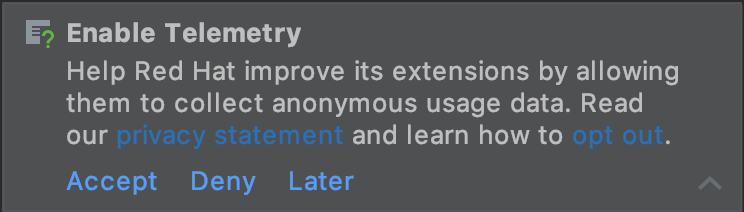
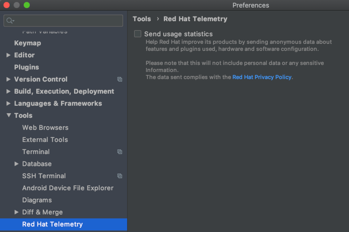

# Red Hat Telemetry
[plugin-repo]: https://plugins.jetbrains.com/plugin/16209-telemetry-by-red-hat
[plugin-version-svg]: https://img.shields.io/jetbrains/plugin/v/16209-telemetry-by-red-hat.svg
[plugin-downloads-svg]: https://img.shields.io/jetbrains/plugin/d/16209-telemetry-by-red-hat.svg

[![JetBrains plugins][plugin-version-svg]][plugin-repo]
[![JetBrains plugins][plugin-downloads-svg]][plugin-repo]

This library provides Telemetry APIs specifically meant to be used by IDEA plugins developped by Red Hat.
## Telemetry reporting
With your approval, plugins published by Red Hat collect anonymous 
[usage data](https://github.com/redhat-developer/intellij-redhat-telemetry/blob/master/USAGE_DATA.md) 
and send it to Red Hat servers to help improve our products and services. Read our 
[privacy statement](https://developers.redhat.com/article/tool-data-collection) to learn more about it.

The first time one of Red Hat plugins is engaging in telemetry collection runs, you will be asked to opt-in Red Hat's 
telemetry collection program:

Whether you accept or deny the request, this pop up will not show again. 
If you choose Later, you'll get asked once you restart your IDE.

You can also opt-in later, by enabling it in the preferences at Tools > Red Hat Telemetry.

This will enable all telemetry events from Red Hat plugins going forward.

## How to disable telemetry reporting?
If you want to stop sending usage data to Red Hat, you can disable it in the preferences at Tools > Red Hat Telemetry.
This will silence all telemetry events from Red Hat plugins going forward.

